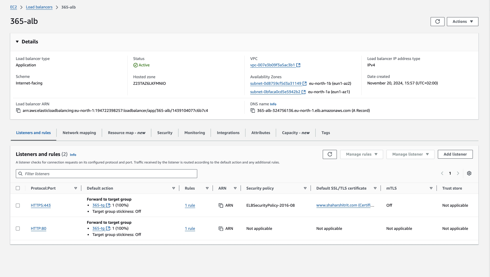
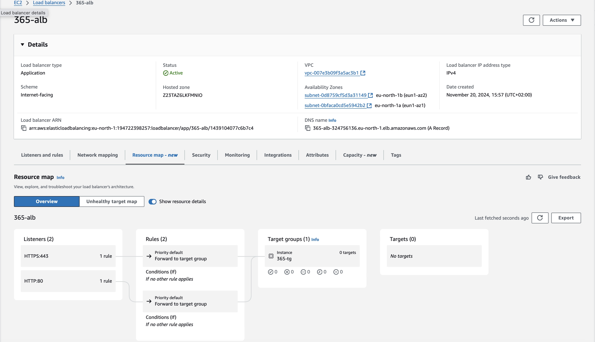
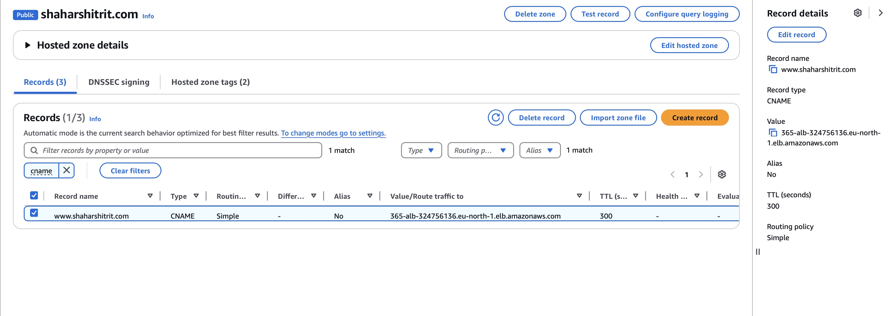
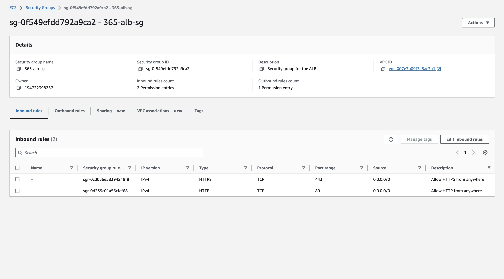
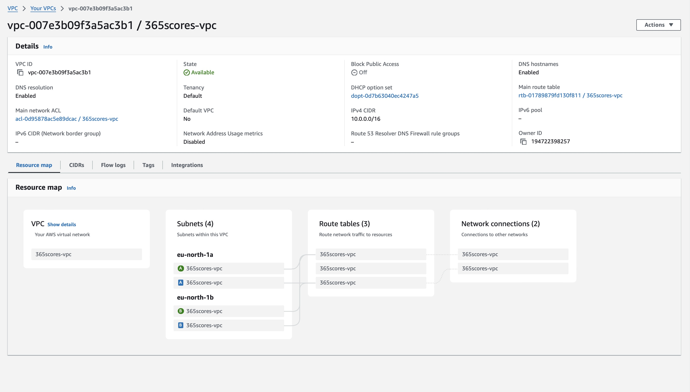

# 365Scores Assignment

This repository contains two main components:

1. **Terraform Code**: Used for provisioning and managing AWS infrastructure.
2. **Python Script**: A tool to retrieve and display AWS resource inventory by region.

---

## Table of Contents
- [Terraform Code](#terraform-code)
  - [Overview](#overview)
  - [Usage](#usage)
- [Python Script](#python-script)
  - [Overview](#overview-1)
  - [Installation](#installation)
  - [Execution](#execution)
- [General Instructions](#general-instructions)
- [Outputs and Visual Validation](#outputs-and-visual-validation)

---

## Terraform Code

### Overview
The Terraform code in this repository is designed to provision AWS resources such as VPCs, ALB, Route53 and security-group components. It provides a modular approach for easy customization and scalability.

### Usage

1. **Install Terraform**: Ensure Terraform is installed. Download it from [Terraform's official website](https://www.terraform.io/).

2. **Navigate to the Terraform Directory**:
   ```bash
   cd terraform
   ```

3. **Initialize Terraform**:
   ```bash
   terraform init
   ```
   This command initializes the working directory, downloading required providers and modules.

4. **Plan Infrastructure Changes**:
   ```bash
   terraform plan
   ```
   This step previews the changes Terraform will make to your infrastructure.

5. **Apply the Configuration**:
   ```bash
   terraform apply
   ```
   Confirm the operation by typing `yes` when prompted. This deploys the infrastructure.

6. **Destroy the Infrastructure**:
   To clean up and remove all resources created by Terraform:
   ```bash
   terraform destroy
   ```

---

## Python Script

### Overview
The Python script, `aws_inventory_by_region.py`, fetches an inventory of AWS resources for a specified region. It utilizes the AWS SDK for Python (`boto3`) for seamless interaction with AWS services.

### Installation

1. **Install Python**: Ensure Python 3.8 or newer is installed. Download it from [Python's official website](https://www.python.org/).

2. **Install Dependencies**: Use the `requirements.txt` file to install necessary Python packages:
   ```bash
   pip install -r requirements.txt
   ```
   Key dependencies include `boto3` for AWS API interactions.

### Execution

1. **Set Up AWS Credentials**:
   - Use the AWS CLI to configure credentials:
     ```bash
     aws configure
     ```
   - Alternatively, export credentials as environment variables:
     ```bash
     export AWS_ACCESS_KEY_ID=<your_access_key>
     export AWS_SECRET_ACCESS_KEY=<your_secret_key>
     ```

2. **Run the Script**:
   Execute the script with the required region parameter:
   ```bash
   python aws_inventory_by_region.py --region <AWS_REGION>
   ```
   Replace `<AWS_REGION>` with the desired AWS region (e.g., `us-east-1`).

3. **Output**:
   The script provides a detailed inventory of AWS resources in the specified region.

---

## General Instructions

### Prerequisites
- An active AWS account with sufficient permissions.
- Installed tools:
  - Terraform
  - Python 3.9+
  - AWS CLI (optional but recommended)

### Workflow
1. Use Terraform to set up the required AWS infrastructure.
2. Run the Python script to retrieve an inventory of AWS resources for a specified region.

### Recommendations
- Use a virtual environment for Python dependencies:
  ```bash
  python -m venv venv
  source venv/bin/activate 
  ```
- Validate your Terraform configurations before applying them to avoid unintended changes.
- Use IAM roles or secure environment variable management to protect AWS credentials.

---
## Outputs and Visual Validation

### Terraform Output
The output generated by the Terraform code can be found in the file:
- `terraform_apply_output.txt`

### Python Script Output
The output from running the Python script can be found in the file:
- `python_script_output.txt`

### Visual Validation
To demonstrate the creation and validation of the requirements, several images from the AWS account have been included:
- `load-balancer.jpg`

- `load-balancer-2.jpg`

- `route53.jpg`

- `security-group.jpg`

- `vpc.jpg`


These images provide visual confirmation of the successful infrastructure setup and its compliance with the requirements.

---
Feel free to reach out if you have any questions or need assistance!
